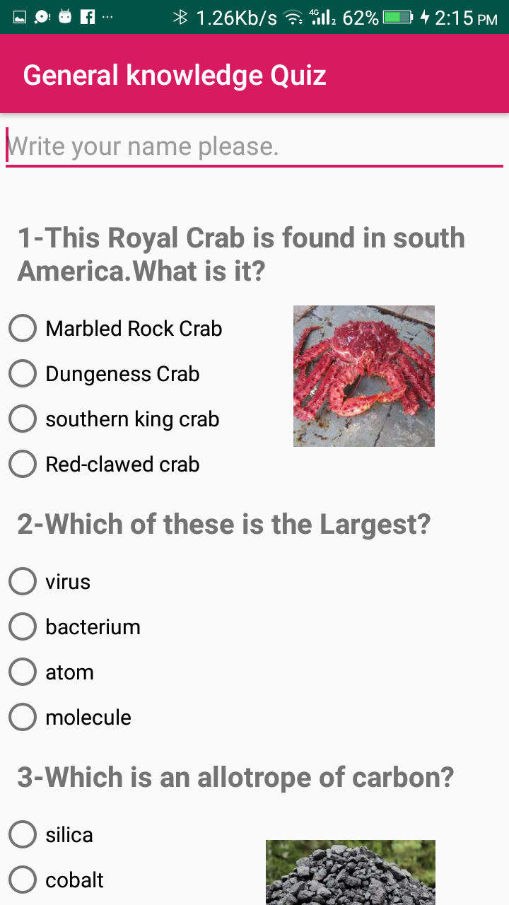
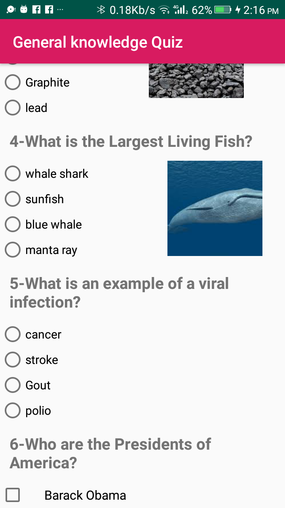
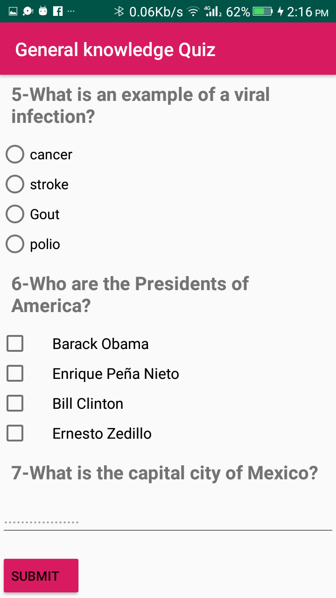
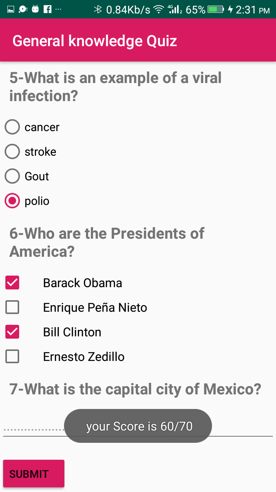

# General-Knowledge-Quiz
The goal is to create an educational app that quizzes a user about General Knowledge.
## Android Goodies
View items: Checkboxes, radio buttons and EditText.
## Description

    5 Question's quizz about General Knowledge.
    It had to contain radio buttons, checkboxes and EditText
    Final score is shown with a Toast
    ## project in steps.
First, build the layout. This involves creating the quiz questions, deciding what type of quiz they will be, and formatting them in the xml layout file for your Activity.
Second, you'll want to write code that links the layout to the activity. For step 3, you'll want variables that refer to each of the quiz answers.
Finally, write the code for the button which checks your answers. This code should run through each question in the app, record whether the user got the question right, and then display the quiz results in a Toast message.

## photos

